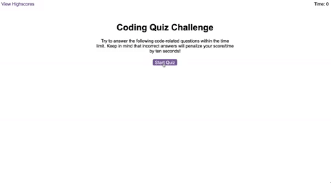

# Code Quiz

## Website:

Link: https://afsha-22.github.io/code-quiz/

> **Note**: The above mockup image is not the true representation of the actual page. Please visit the above link to experience the actual design and functionalities.

## Objectives & Functionalities:

1. The user can take the quiz by clicking on 'Start Quiz' button.
2. When the quiz starts, timer starts and presented with questions.
3. When user selects one of the given option, they move to the next question.
4. When user selects wrong answer, 5 seconds are detected from the timer.
5. When all questions are answered or timer reaches 0, quiz gets over.
6. When quiz gets over, name and score is set in the local storage and also displayed on the High Score page.
7. The High Score page can be accessed anytime and when clear the high score, it clears from local storage as well.
